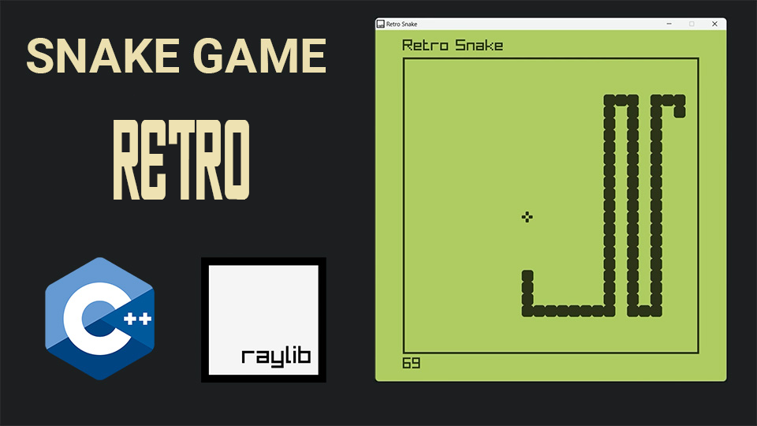

# C++ Juego Retro del Snake usando POO y la libreria grafica "raylib"

En este repositorio de GitHub contiene el código fuente completo de un juego Snake creado con la biblioteca de desarrollo de juegos RAYLIB. El juego está programado en el lenguaje de programación C++ y utiliza varias funciones raylib para gráficos, manejo de entrada y audio. El juego está diseñado para jugarse en computadoras de escritorio con sistemas operativos Windows, macOS o Linux. El código está bien estructurado, es fácil de leer y cuenta con muchos comentarios, lo que lo convierte en un recurso excelente para los aspirantes a desarrolladores de juegos que desean aprender más sobre la programación de juegos usando RAYLIB.

Si estás interesado en aprender cómo crear tu propio juego de serpientes con raylib, entonces querrás ver el codigo fuente del juego que te lleva a través de cada línea, explica la lógica detrás de ella y demuestra cómo afecta al juego. Aprenderá cómo configurar la ventana del juego, crear clases de serpientes y alimentos, agregar detección de colisiones e implementar efectos de sonido. Al final de observar todo el codigo y compilarlo en su plataforma, tendrás un juego de serpientes completamente funcional que podrás jugar y modificar a tu gusto.

Entonces, ¡toma una taza de café y prepárate para sumergirte en el mundo del desarrollo de juegos con RAYLIB!

El temario que he ido haciendo paso a paos es el siguiente:

 1.- Creacion de un canvas en blanco y un GameLoop (bucle de juego)
 2.- Creando alimentos aleatorios
 3.- Creando Snake (Serpiente)
 4.- Moviendo a Snake
 5.- Hacer que Snake coma la comida
 6.- Hacer que Snake crezca mas y mas
 7.- Chequeo de colisiones con los bordes y su cola
 8.- Añadiendo titulos y marcos
 9.- Keeping Score & Marcadores
10.- Añadir sonidos

Pongo todos las partes del codigo de como ir avanzando en funcion de los logros que vamos realizando en cada paso del indice que hemos creado.

La versión final del codigo completo, se llama snake.cpp, compilamos y listo !!!

Disfruta como yo he echo, jugando a este juego cuando era joven.

# Enlaces de Interes

  

 
 

| 📺 <a href="https://nvarona.x10.bz/">My Web Personal Channel</a>
| 🌍 <a href="https://nvarona.x10.bz/blog">My Blog Website</a> | 2024 

